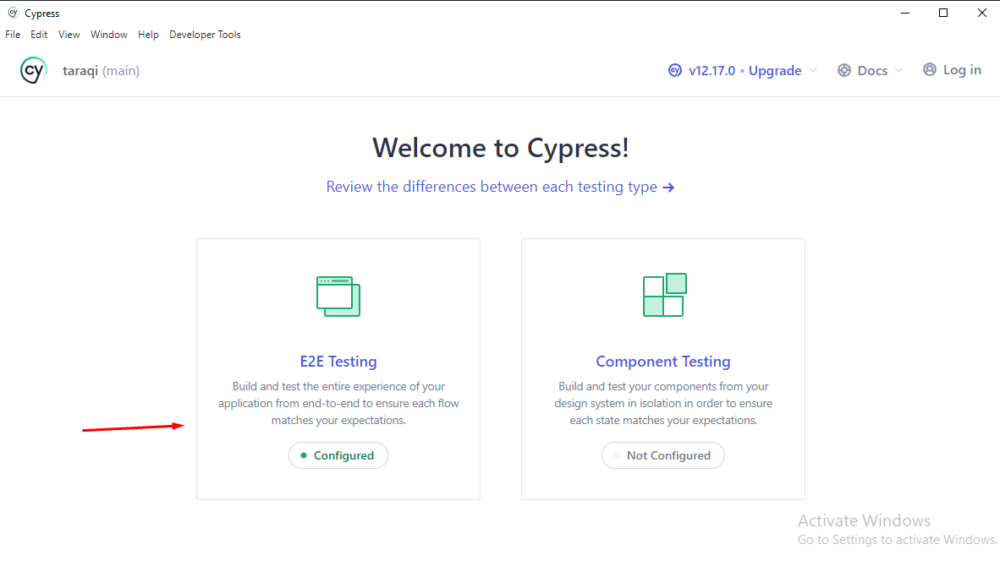
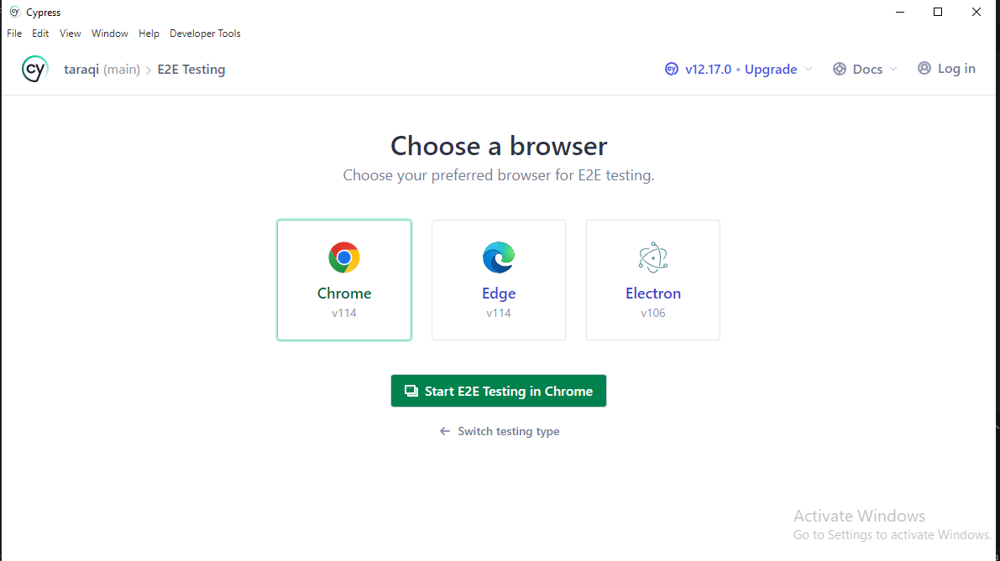
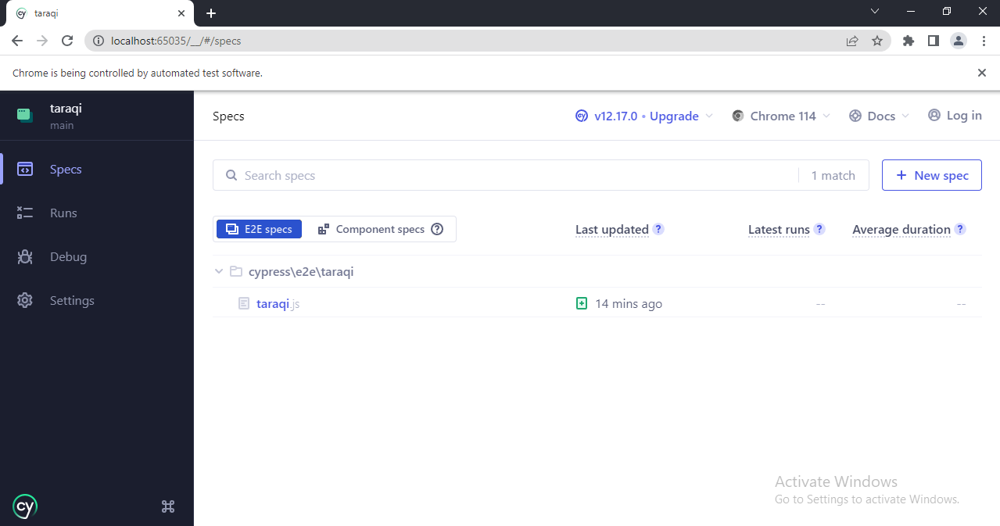
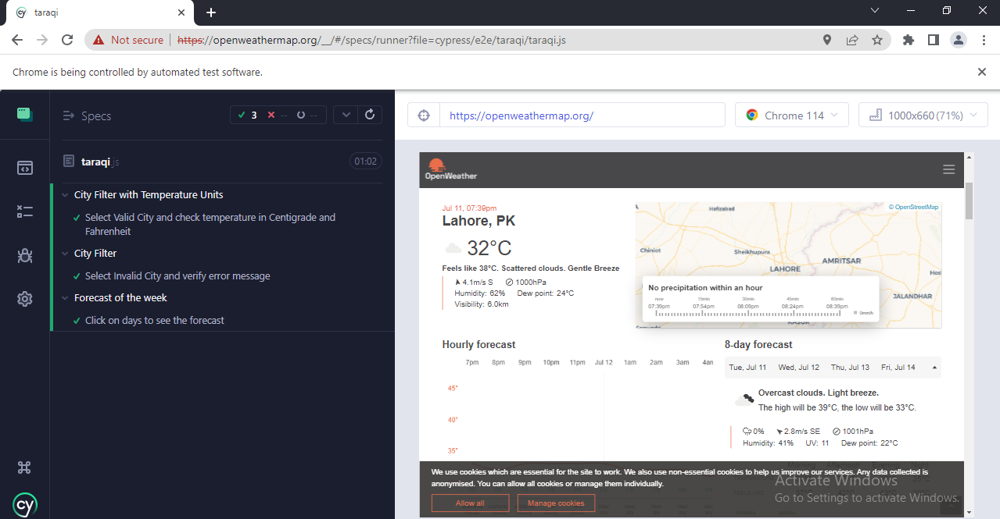

# Taraqi Automation

**NOTE** : Must have node and npm install.
In case Node.js is not installed it can be downloaded from [here](https://nodejs.org/en/download). 

## Dependency Installation

To install all required project dependencies use:

`npm install`

or

`yarn` if you have it installed

## Running Test Cases 

To run the test cases use:

`npx cypress open`

After running the given command, Cypress Test 

- Runner will open.
Click on the E2E.

- Select E2E testing in chrome.

- Select the taraqi.spec file

- Test Cases Passed

<a href="https://www.loom.com/share/3e315b5b1bf144d6aa152481921a877b">
    
Test Run

    
  </a>

